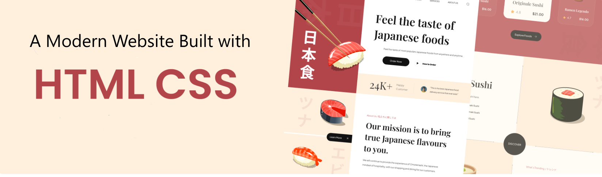

<div align="center">
  <br />
      
    
  <br />

  <div>
    
    
  </div>

  <h3 align="center">Sushi Website</h3>
</div>

## 📋 <a name="table">Table of Contents</a>

1. 🤖 [Introduction](#introduction)
2. ⚙️ [Tech Stack](#tech-stack)
3. 🔋 [Features](#features)
4. 🤸 [Quick Start](#quick-start)
5. 🕸️ [Snippets](#snippets)
6. 🔗 [Links](#links)
7. 🚀 [More](#more)


## <a name="introduction">🤖 Introduction</a>

This project was developed purely for educational purposes while I practiced modern HTML & CSS techniques. The layout and component structure were inspired by a tutorial published on YouTube.

## <a name="tech-stack">⚙️ Tech Stack</a>

- HTML 5
- CSS 3
- Vite

## <a name="features">🔋 Features
- **Responsive design** – looks great on mobile, tablet, and desktop  
- **CSS variables & imports** – easy theming and scalable stylesheets  
- **Smooth scroll & fade-in animations** via [AOS](https://github.com/michalsnik/aos)  
- **BEM class naming** – predictable, reusable components  
- Modular file/folder layout for hassle-free maintenance


## <a name="quick-start">🤸 Quick Start</a>

Follow these steps to set up the project locally on your machine.

**Prerequisites**

Make sure you have the following installed on your machine:

- [Git](https://git-scm.com/)
- [Node.js](https://nodejs.org/en)
- [npm](https://www.npmjs.com/) (Node Package Manager)

**Cloning the Repository**

```bash
git clone https://github.com/NuranRamis/html_css_project.git
cd html_css_project
```

**Installation**

Install the project dependencies using npm:

```bash
npm install
```

**Running the Project**

```bash
npm run dev
```

Open [http://localhost:5173](http://localhost:5173) in your browser to view the project.

